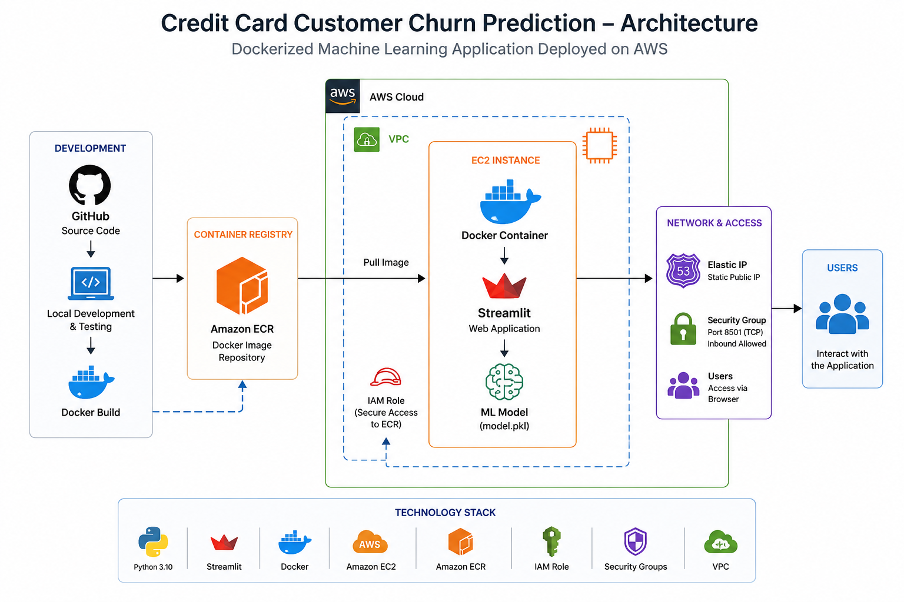
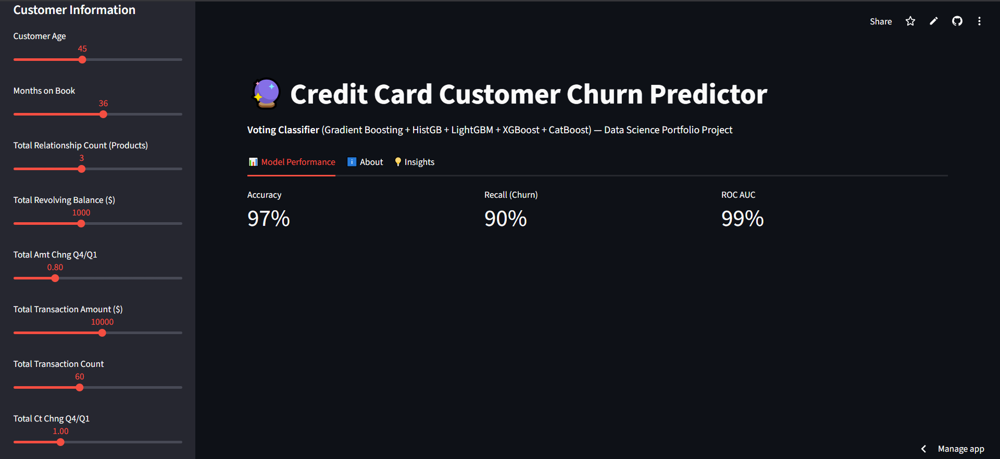
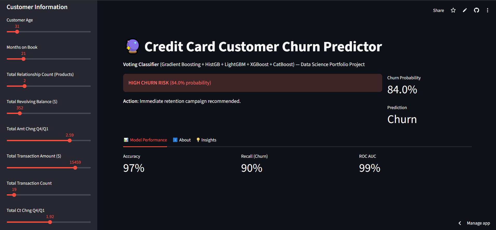
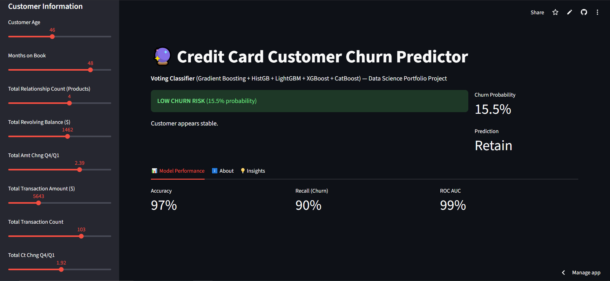

# Credit Card Customer Churn Prediction

> **An end-to-end machine learning application for predicting customer churn, containerized with Docker and deployed on AWS using Amazon ECR and EC2.**


---

# Live Demo

**Application:** http://54.159.126.201:8501/

> **Note:** This application is hosted on an AWS EC2 instance for portfolio purposes. To minimize cloud costs, the instance may be stopped when not actively being demonstrated. If the application is unavailable, please see the streamlit link, screenshots below, or the deployment architecture.

**🔗 Live Demo:** [https://credit-card-customer-churn-app-grantg.streamlit.app/](https://credit-card-customer-churn-app-grantg.streamlit.app/)

---

# Project Overview

This project demonstrates an end-to-end machine learning deployment workflow for predicting customer churn.

The goal was not only to build an accurate predictive model, but also to package, deploy, and host it using production-oriented tools commonly used by Machine Learning Engineers.

Users can interactively modify customer attributes and receive real-time churn predictions through an intuitive Streamlit web application. The application is fully containerized with Docker and deployed on AWS using Amazon Elastic Container Registry (ECR) and Amazon EC2.

---

# Features

- Interactive Streamlit web application
- Real-time customer churn prediction (Soft Voting Classifier (Gradient Boosting + HistGradientBoosting + LightGBM + XGBoost + CatBoost))
- Prediction probability score (97% Accuracy | 90% Recall)
- Input validation
- Fast model inference
- Docker containerization
- AWS cloud deployment
- Container image stored in Amazon ECR
- IAM role-based authentication between EC2 and ECR
- Static Elastic IP endpoint
- Automatic container restart on server reboot

---

# System Architecture



---

# Technology Stack

## Machine Learning

- Python
- scikit-learn
- XGBoost
- LightGBM
- CatBoost
- Pandas
- NumPy
- Joblib

## Application

- Streamlit

## Cloud & Deployment

- Docker
- Amazon EC2
- Amazon ECR
- IAM Roles
- Elastic IP
- AWS Security Groups
- Amazon Linux 2023

---

# Deployment Workflow

This application follows a production-style deployment workflow:

1. Develop and test the application locally
2. Containerize the application using Docker
3. Push the Docker image to Amazon ECR
4. Launch an Amazon EC2 instance
5. Authenticate EC2 to ECR using an IAM role
6. Pull the Docker image from ECR
7. Run the Streamlit application inside the Docker container
8. Expose the application using an Elastic IP and AWS Security Groups

This deployment approach creates a reproducible, isolated runtime environment that closely mirrors real-world machine learning deployments.

---

# Running Locally

Clone the repository:

```bash
git clone https://github.com/GrantGonnerman/credit-card-customer-churn-app.git
cd credit-card-customer-churn-app
```

Install dependencies:

```bash
pip install -r requirements.txt
```

Run the application:

```bash
streamlit run app.py
```

---

# Running with Docker

Build the Docker image:

```bash
docker build -t churn-app .
```

Run the container:

```bash
docker run -p 8501:8501 churn-app
```

Open:

```
http://localhost:8501
```

---

# Project Structure

```text
credit-card-customer-churn-app/

├── data/
│   └── Base datasets
│
├── notebooks/
│   └── Model development and experimentation
│
├── screenshots/
│   └── Application screenshots
│
├── app.py
├── Dockerfile
├── requirements.txt
├── feature_names.csv
├── model.pkl
└── README.md
```

---

# Machine Learning Model

The application uses a supervised machine learning classification model trained to predict whether a customer is likely to churn.

The trained model is serialized using Joblib and loaded into the Streamlit application at runtime to generate real-time predictions from user-provided inputs.

---

# Deployment Challenges Solved

During deployment, several real-world engineering challenges were encountered and resolved:

- Matched Python runtime versions between development and production
- Pinned machine learning library versions for model compatibility
- Resolved Linux shared library dependencies (`libgomp`)
- Containerized the application using Docker
- Published Docker images to Amazon ECR
- Configured IAM roles for secure authentication
- Deployed the application on AWS EC2
- Configured AWS Security Groups for public access
- Assigned an Elastic IP for a persistent application endpoint

---

# Future Improvements

Potential future enhancements include:

- Batch CSV prediction
- SHAP explainability
- Prediction history and logging
- MLflow experiment tracking
- FastAPI inference API
- GitHub Actions CI/CD pipeline
- Automated Docker deployments
- Nginx reverse proxy
- HTTPS with SSL certificates
- Custom domain name
- Monitoring and health checks

---

# Screenshots

**Main Interface**  


**High Churn Risk Prediction**  


**Low Churn Risk Prediction**  


---

# Skills Demonstrated

## Machine Learning

- Classification
- Feature engineering
- Model serialization
- Real-time inference

## Software Engineering

- Python application development
- Dependency management
- Docker containerization
- Project organization

## Cloud & DevOps

- AWS EC2
- Amazon ECR
- IAM
- Security Groups
- Elastic IP
- Linux
- SSH
- Docker image management

---

# Author

**Grant Gonnerman**

Master of Science in Data Science

**GitHub**

https://github.com/GrantGonnerman

**LinkedIn**

https://www.linkedin.com/in/grant-gonnerman

---

## Project Highlights

This project demonstrates the complete lifecycle of deploying a machine learning application:

- Developing and evaluating a predictive model
- Building an interactive web application
- Containerizing the application with Docker
- Deploying to AWS using Amazon EC2 and ECR
- Configuring IAM roles and Security Groups
- Hosting a publicly accessible machine learning application

This project was built to showcase both machine learning and cloud deployment skills in a production-oriented environment.
